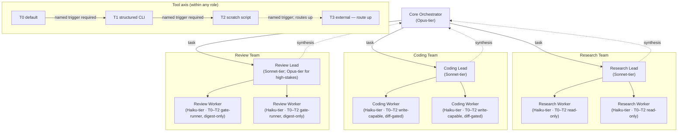

# tier-layered-teams

A two-axis lattice that folds two existing suites together. The **model axis**, from
[tiered-team-orchestration](../tiered-team-orchestration/README.md), tiers *who* does the
work: an Opus-tier Core Orchestrator plans and decomposes but never executes, Sonnet-tier
team leads (research, coding, review) decompose their team's assignment and fan it out,
and Haiku-tier workers each do one narrow task. The **tool axis**, from
[tiered-escalation-suite](../tiered-escalation-suite/README.md), tiers *what* any role
reaches for while doing that work: default to the cheapest tool (T0), escalate to a
structured CLI (T1) or a scratch script (T2) only when a named trigger fires, and treat
external/stateful tools (T3) as something that routes up rather than something any role
grabs for itself. The two axes are independent and orthogonal — a Haiku-tier worker can
self-escalate its tool tier; no role, at any tier, can self-escalate its model tier. The
pattern ships as two harness-native variants, `claude-code/` and `copilot/`, with this
suite's root docs as the vendor-agnostic canonical source.

## Entry point

- **Claude Code variant**: dispatch
  [`claude-code/agents/01-core-orchestrator.md`](claude-code/agents/01-core-orchestrator.md)
  with the goal — the Opus-tier hub that plans, decomposes, and routes to the three team leads.
- **Copilot variant**: deploy the [`copilot/`](copilot/) payload into the target repo (see
  [USAGE.md](USAGE.md)); the routing contract is
  [`copilot/.github/copilot-instructions.md`](copilot/.github/copilot-instructions.md) —
  always-on rather than a live dispatch target.

## The pattern

## How it works

Two independent axes tier the same team hierarchy:

- **Model axis** — *who* does the work. The Core Orchestrator plans and routes at
  Opus-tier and never executes; each Sonnet-tier team lead decomposes its team's
  assignment, fans narrow subtasks out to its Haiku-tier workers, and synthesizes the
  results back up; the Review Lead runs at Opus-tier for high-stakes reviews.
- **Tool axis** — *what* any role reaches for while doing its work. Within a role's
  ceiling, default to T0; escalate to T1 or T2 only when a named trigger fires; T3
  (external/stateful) always routes up rather than being grabbed directly.

**Authority rule**: tool-axis escalation is self-serve within a role's ceiling, given a
named trigger — a worker can pick up a bigger tool on its own. Model-axis escalation is
decided one level up, never self-serve — a role that needs a bigger brain reports
ESCALATE with the trigger named and waits for its dispatcher to authorize the upgrade.
Short form: **you may grab a bigger tool yourself; you may never grab a bigger brain
yourself — ask up.**

The three genres from tiered-escalation-suite map onto the three teams from
tiered-team-orchestration:

| Genre | Team | Notes |
|---|---|---|
| Surveyor | Research team | Read-only by construction |
| Transformer | Coding team | Write-capable, diff-gated |
| Verifier | Review workers + judgment-layer review lead | Workers run callable gates and report digest-only; the lead adds the judgment layer |

Two principles are preserved from both parents, unscaled by tier:

1. **Hooks/exit-codes are the authority; agents exist for context isolation.** Review
   workers run mechanical gates and return digests without authority of their own —
   mechanical gates decide pass/fail, the review team decides ship.
2. **Invariants never scale down with tier**, on either axis: diff-before-apply at every
   tier, every count verified two independent ways, and the deterministic gate runs after
   every edit.

The full trigger tables for both axes, plus the invariants list, live in
[PROTOCOL.md](PROTOCOL.md) — that file is the canonical source; don't look for a second
copy of the tables here.

## Tier-to-vendor mapping

Only the Claude column is concrete; the "any other vendor" column names the capability
class a given tier requires, not a specific model.

| Tier | Role in the pattern | Claude (reference) | Any other vendor |
|---|---|---|---|
| Orchestrator | Reasoning, planning, task decomposition; routes but never executes | `claude-opus-4-8` | frontier reasoning model |
| Lead | Decomposes a team's assignment, dispatches to workers, synthesizes results (Review Lead escalates to Opus-tier for high-stakes reviews) | `claude-sonnet-5` (`claude-opus-4-8` for high-stakes review) | mid coordination model (frontier, for high-stakes review) |
| Worker | Executes one narrow, bounded task within its role's tool ceiling — T0 by default, self-escalating to T1/T2 on a named trigger | `claude-haiku-4-5-20251001` | fast execution model |

## Components

| Role | claude-code variant | copilot variant |
|---|---|---|
| Escalation protocol (canonical: [PROTOCOL.md](PROTOCOL.md)) | [claude-code/agents/00-escalation-protocol.md](claude-code/agents/00-escalation-protocol.md) | [copilot/.github/skills/trigger-semantics/SKILL.md](copilot/.github/skills/trigger-semantics/SKILL.md) |
| Core orchestrator | [claude-code/agents/01-core-orchestrator.md](claude-code/agents/01-core-orchestrator.md) | [copilot/.github/copilot-instructions.md](copilot/.github/copilot-instructions.md) |
| Research lead | [claude-code/agents/02-research-lead.md](claude-code/agents/02-research-lead.md) | [copilot/.github/agents/research-lead.agent.md](copilot/.github/agents/research-lead.agent.md) |
| Coding lead | [claude-code/agents/03-coding-lead.md](claude-code/agents/03-coding-lead.md) | [copilot/.github/agents/coding-lead.agent.md](copilot/.github/agents/coding-lead.agent.md) |
| Review lead | [claude-code/agents/04-review-lead.md](claude-code/agents/04-review-lead.md) | [copilot/.github/agents/review-lead.agent.md](copilot/.github/agents/review-lead.agent.md) |
| Research worker | [claude-code/agents/05-research-worker.md](claude-code/agents/05-research-worker.md) | [copilot/.github/agents/research-worker.agent.md](copilot/.github/agents/research-worker.agent.md) |
| Coding worker | [claude-code/agents/06-coding-worker.md](claude-code/agents/06-coding-worker.md) | [copilot/.github/agents/coding-worker.agent.md](copilot/.github/agents/coding-worker.agent.md) |
| Review worker | [claude-code/agents/07-review-worker.md](claude-code/agents/07-review-worker.md) | [copilot/.github/agents/review-worker.agent.md](copilot/.github/agents/review-worker.agent.md) |

The copilot variant additionally ships supporting skills, hooks, scripts, a `Makefile`,
and `.vscode` config as a self-contained payload — see [USAGE.md](USAGE.md).

## Variant divergences

The two variants are harness-native, not mirror images of each other:

- **Claude Code variant is hub-pure**: the Core Orchestrator routes coding output to the
  review team itself; leads never address each other directly.
- **Copilot variant uses the harness's native handoff**: the Coding Lead hands off
  directly to the Review Lead after a mutation, mirroring the parent
  tiered-escalation-suite's Transformer→Verifier gate. The always-on
  `copilot-instructions.md` plays the orchestrator role, so its "routing" is a standing
  contract rather than a live Opus-tier agent — the model axis is advisory there: run
  Copilot Chat on a frontier model.

## Relationship to other suites

This suite composes two existing ones and supersedes neither:

- [tiered-team-orchestration](../tiered-team-orchestration/README.md) — the single-axis
  reference implementation for the model axis (Opus orchestrator → Sonnet leads → Haiku
  workers). Remains the reference for model-cost tiering alone.
- [tiered-escalation-suite](../tiered-escalation-suite/README.md) — the single-axis
  reference implementation for the tool axis (T0–T3 escalation on a named trigger).
  Remains the reference for tool-capability tiering alone.
