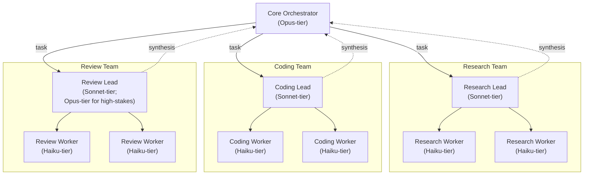

# tiered-team-orchestration

A hybrid-AI-engineering pattern that maps model cost to cognitive altitude: an Opus-tier
Core Orchestrator does all the reasoning, planning, and task decomposition but delegates
every execution step to Sonnet-tier team leads — one each for research, coding, and
review — who in turn decompose their team's assignment, fan narrow subtasks out to
Haiku-tier workers, and synthesize the results back up. The pattern is vendor-agnostic:
any provider's frontier/mid/fast model tiers slot into the same three altitudes; Claude
Code is the reference implementation.

## Entry point

Start with [`agents/01-core-orchestrator.md`](agents/01-core-orchestrator.md) — the hub
that plans and routes to the three team leads.

## The pattern

## How it works

Three altitude rules, one per tier:

- **The Orchestrator plans and routes; it never executes.** It turns a goal into a set of
  team-scoped assignments, dispatches them to the appropriate lead, and integrates each
  lead's synthesized result into the next decision. It does not read files, write code, or
  run reviews itself.
- **Leads decompose, dispatch, and synthesize; they don't do worker-scale work.** A lead
  breaks its team's assignment into narrow, independently-answerable subtasks, fans them
  out to its Haiku-tier workers, and folds the returned results into one coherent report
  for the Orchestrator. A lead that starts doing the grep-and-read work itself has
  collapsed the tier.
- **Workers do exactly one narrow task and report structured results.** A worker gets a
  single, bounded instruction — search a path, edit a scoped file, check one review
  criterion — and returns a compact, structured result. It never receives the whole goal
  and never talks to another worker or the Orchestrator directly.

This shape exists for three reasons:

1. **Token cost concentrates where judgment matters.** The expensive model spends its
   budget on planning and integration — the steps where a wrong call is costly — not on
   mechanical reads.
2. **Cheap parallelism where judgment doesn't matter.** Fanning fifty narrow lookups out
   to Haiku-tier workers costs a fraction of doing the same work at Sonnet- or Opus-tier,
   and workers run in parallel.
3. **Context isolation.** Each worker gets a fresh, narrow context and reports back a
   digest — its intermediate noise (full file contents, failed search attempts, dead
   ends) never enters the lead's or the Orchestrator's context window.

## Tier-to-vendor mapping

Only the Claude column is concrete; the "any other vendor" column names the capability
class a given tier requires, not a specific model — any provider's frontier/mid/fast
tiers slot in.

| Tier | Role in the pattern | Claude (reference) | Any other vendor |
|---|---|---|---|
| Orchestrator | Reasoning, planning, task decomposition; routes but never executes | `claude-opus-4-8` | frontier reasoning model |
| Lead | Decomposes a team's assignment, dispatches to workers, synthesizes results | `claude-sonnet-5` | mid coordination model |
| Worker | Executes one narrow, bounded task, reports a structured result | `claude-haiku-4-5-20251001` | fast execution model |

## Components

| File | Role |
|---|---|
| [agents/01-core-orchestrator.md](agents/01-core-orchestrator.md) | Opus-tier hub. Decomposes the goal, dispatches to the three team leads, integrates their synthesized results; never executes work itself |
| [agents/02-research-lead.md](agents/02-research-lead.md) | Sonnet-tier lead. Decomposes a research assignment, fans narrow lookups out to Research Workers, synthesizes their findings |
| [agents/03-coding-lead.md](agents/03-coding-lead.md) | Sonnet-tier lead. Decomposes a coding assignment into scoped edits, dispatches them to Coding Workers, synthesizes the resulting change set |
| [agents/04-review-lead.md](agents/04-review-lead.md) | Sonnet-tier lead (Opus-tier for high-stakes reviews). Decomposes a review into focused checks, dispatches them to Review Workers, synthesizes a verdict |
| [agents/05-research-worker.md](agents/05-research-worker.md) | Haiku-tier worker. Runs one narrow lookup or search, reports a structured finding |
| [agents/06-coding-worker.md](agents/06-coding-worker.md) | Haiku-tier worker. Makes one narrow, scoped edit, reports the change made |
| [agents/07-review-worker.md](agents/07-review-worker.md) | Haiku-tier worker. Checks one narrow review criterion, reports pass/fail with evidence |

## Relationship to other suites

Closest relative: [hub-and-spoke-orchestration](../hub-and-spoke-orchestration/README.md) —
same hub-routing discipline (spokes never address each other directly, only the hub), but
a single flat team of role-specialized spokes at one model tier. This suite adds a middle
management tier (the leads) and makes model-cost tiering itself the organizing axis.

Disambiguate from [tiered-escalation-suite](../tiered-escalation-suite/README.md): same
word, different axis. That suite's tiers (T0–T3) are **tool-capability escalation** within
two same-status peer agents on GitHub Copilot — same model, escalating tool access. This
suite's tiers are **model-cost/capability layers** in a command hierarchy — different
models at each level of a chain of delegation.
